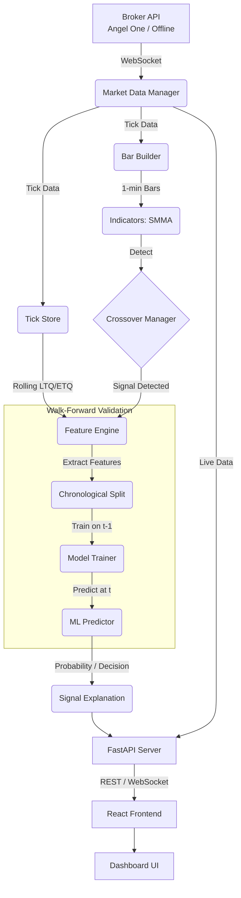

# QuantumGrow: AI/ML Stock Market Screening and Analysis System

[](https://quantumgrow-ai.onrender.com)

A production-quality full-stack application that scans NSE-listed stocks in real-time, applies quantitative screening filters, computes SMMA indicators, detects crossovers, and uses ML models to predict crossover profitability.

## Project Overview
This system is designed as an institutional-grade stock screener and AI/ML predictor. It connects to live broker APIs to ingest tick data, computes complex order-book and quantitative features (like ETQ and LTQ), detects SMMA state transitions, and evaluates whether a given crossover signal should be ACCEPTED or AVOIDED based on historical ML analysis.

## Features
- **Real-time NSE Stock Scanning**: Built on Angel One SmartAPI and FYERS for live market data.
- **Quantitative Filters**: LTP filter (₹30-₹500) and liquidity filter (Bid/Ask Qty > 1M).
- **Advanced Technicals**: SMMA(20) / SMMA(120) moving average crossover detection.
- **Machine Learning Predictor**: Logistic Regression, Random Forest, XGBoost trained to predict crossover profitability.
- **Extensive Feature Engineering**: 25+ features including ETQ (Estimated Traded Quantity), LTQ, Order Imbalance, and SMMA distances.
- **State-of-the-art Web Dashboard**: Built with React, TypeScript, and Lightweight Charts for a professional, responsive UI.
- **Asynchronous Python Backend**: FastAPI-powered backend handling WebSockets, data persistence (SQLite/Parquet), and ML pipelines in real-time.
- **Offline Demo Mode**: Fully simulates live market conditions, ticks, and chart bars for evaluation purposes without needing active broker credentials.

## Architecture (Data Flow & ML Pipeline)


## Tech Stack
### Backend & Data Pipeline
- **Core**: Python 3.10+
- **API Server**: FastAPI, Uvicorn, WebSockets
- **Data Engineering**: pandas, numpy, pyarrow
- **Machine Learning**: scikit-learn, XGBoost, joblib
- **Storage**: SQLite (relational data), Parquet (high-volume ticks)

### Frontend Dashboard
- **Framework**: React, TypeScript, Vite
- **Styling**: Vanilla CSS (glassmorphism/dark mode)
- **State Management**: Zustand
- **Charting**: Lightweight Charts v5 (TradingView), Recharts, Framer Motion

## Environment Setup & Configuration

### 1. Installation
```bash
git clone <repo-url>
cd "AI stock predictor"

# Install backend dependencies
pip install -r requirements.txt

# Install frontend dependencies (optional, for development)
cd web
npm install
cd ..
```

### 2. Configuration
Copy `.env.example` to `.env` and configure your settings. Magic numbers are intentionally removed from the codebase in favor of centralized settings.

Key configurations in `config/settings.py` (overridable via `.env`):
- `MODE`: `LIVE` or `OFFLINE` (default)
- `LTP_MIN` / `LTP_MAX`: Screening thresholds
- `MIN_BID_QTY` / `MIN_ASK_QTY`: Liquidity thresholds
- `SMMA_FAST` / `SMMA_SLOW`: Indicator periods (default 20, 120)
- `ML_THRESHOLD`: Decision threshold (default 0.65)

### 3. Broker Setup
To run against live market data, you must provide valid broker credentials in your `.env` file:
```env
BROKER=angel_one # or fyers
API_KEY=your_api_key
CLIENT_ID=your_client_id
PASSWORD=your_password
TOTP_SECRET=your_totp_secret
```

## How to Run

**1. Offline Demo Mode (Default):**
```bash
# Starts the backend, uses simulated data, and serves the UI
python run.py
```
Then navigate to `http://127.0.0.1:8000/` in your browser.

**2. Development Mode:**
If you want to run the React development server with hot-reloading alongside the FastAPI backend:
```bash
python run.py --dev
```

**3. Start Live Dashboard:**
Ensure `MODE=LIVE` in your `.env` and run `python run.py`. The dashboard will automatically connect via WebSockets to stream live broker data.

## ML & Quantitative Methodology

### Data Format & Storage
- **Relational Data**: SQLite stores normalized trades, signal histories, and ML model performance metrics.
- **Tick Storage**: Raw high-volume ticks are capped in memory (90 min rolling window) and flushed to Parquet files.

### Feature Engineering
25+ features are generated at the exact time of crossover, strictly preventing data leakage.
- **LTQ Features**: Averages over 2m, 5m, ratio between 2m/5m, and acceleration.
- **Orderbook Features**: Imbalance `(Bid Qty - Ask Qty) / (Bid Qty + Ask Qty)`, spread, and spread percentage.
- **Price Features**: Returns over 1m, 5m, and 15m.
- **SMMA Features**: Distance between SMMA20 and SMMA120, and their recent slopes.

### SMMA & Crossover Methodology
- **SMMA**: Smoothed Moving Average is used, not EMA. Formula: `SMMA_t = (SMMA_{t-1} × (N-1) + Price_t) / N`. It is computed on live 1-minute bars.
- **Crossovers**: Signals are generated only upon actual state transitions (e.g. SMMA20 crosses above SMMA120).

### ETQ vs Volume
- **Volume**: Cumulative daily traded quantity.
- **LTQ (Last Traded Quantity)**: Quantity of the most recent individual trade.
- **ETQ (Estimated Traded Quantity)**: Sum of LTQ over rolling windows (5m, 20m, 60m) to accurately measure short-term market participation momentum.

### ML Methodology & Evaluation Metrics
- **Target**: Profitability of a detected crossover. BUY profitable if exit > entry; SELL profitable if exit < entry.
- **Walk-Forward Validation**: The system uses a strict expanding-window, walk-forward validation methodology for historical predictions. The model only ever trains on trades that occurred *strictly before* the target trade, eliminating all lookahead bias.
- **Single-Class Protection**: The training loop includes strict integrity checks that return `INSUFFICIENT_DATA` if the training window contains fewer than 50 trades or only possesses a single target class (e.g. 100% profitable).
- **Handling Imbalance**: Uses `class_weight='balanced'`.
- **Evaluation Metrics**: Models are evaluated on traditional metrics (Accuracy, ROC-AUC, F1) as well as critical trading metrics (Win Rate, Total P&L, Profit Factor, Max Drawdown).

### Explainable AI (XAI)
To ensure transparency in trading decisions, the system generates human-readable explanations for every ACCEPT/AVOID signal. Instead of using black-box LLMs, explanations are strictly rule-based and derived from the quantitative feature vectors. 
- **Example ACCEPT**: "LTQ 2-minute average is significantly above 5-minute average. Positive order-book imbalance."
- **Example AVOID**: "Spread is elevated. Short-term price momentum is negative."

### How to Train Model
Models are retrained on historical data using the `ModelTrainer` class. You can trigger a retrain via the dashboard's Settings page or by calling the `POST /api/models/retrain` REST endpoint.

## Security Considerations
- **No Hardcoded Secrets**: All credentials (API keys, passwords, TOTP) are managed via `.env` variables and NEVER committed to the repository (enforced via `.gitignore`).
- **No Log Leaks**: The structured logging module ensures credentials are never printed to `logs/application.log`.

## Packaging Instructions (Windows EXE)
A PyInstaller spec file is provided to bundle the Python backend and React frontend into a standalone Windows executable.
1. Build the React frontend: `cd web && npm run build`
2. Run the packaging script: `python build_exe.py`
3. The executable will be generated in the `dist/` directory.

## Demo & Diagnostics
- **Offline Demo**: Follow the steps in `DEMO_SCRIPT.md` to conduct a comprehensive offline demonstration of the software's capabilities.
- **Live Connection Test**: To verify the broker data pipeline safely, configure your `.env` with real credentials and run `python tests/live_diagnostic.py`. This read-only script tests WebSocket authentication and tick parsing for a small watchlist (e.g. RELIANCE-EQ) without initiating the entire trading application.

## Known Limitations
- The system heavily relies on broker API stability. In `LIVE` mode, frequent API rate-limiting or WebSocket disconnections may impact realtime ETQ calculations.
- Machine Learning models predict based on historical patterns; market regime changes will require retraining.

## Disclaimer
This is a technical assignment and research application. It does NOT guarantee profitable trading. ML predictions represent historical pattern analysis, not financial advice.
